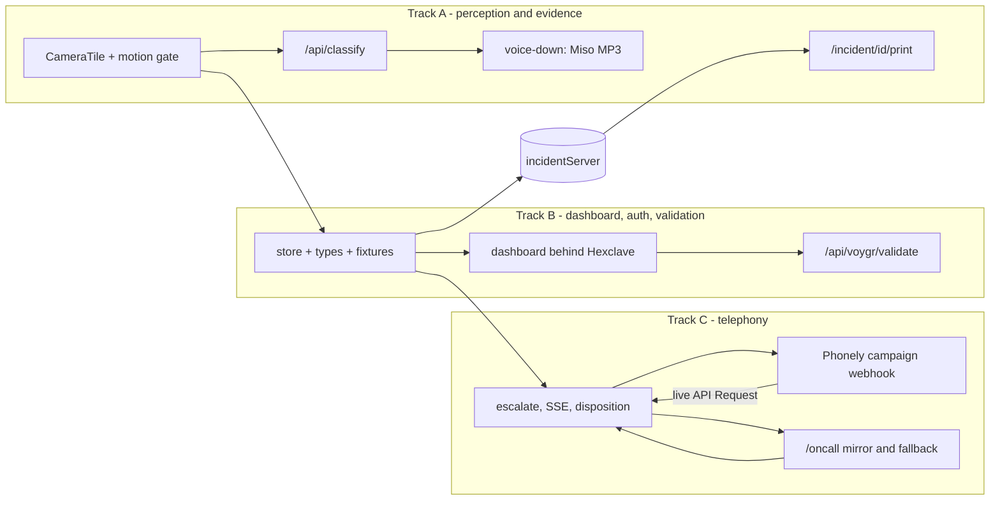

# Warden — three-track build split (full scope)

`trd.md` wins over `prd.md` per `CLAUDE.md`. `basic-plan.md` is disregarded — this is a **live stage demo**.

**Submission is tomorrow, so nothing is cut.** The real phone call, Hexclave auth, Miso's voice, and VOYGR all ship. What replaces the clock as the organizing constraint is *ordering*: everything that waits on a human, an email, or an identity check happens in the first thirty minutes, so it is processing while we write code.

## What the research actually turned up

Four sponsors, and three of them are not what `trd.md` assumed.

- **Miso Labs — confirmed, and the API does not exist yet.** Aoden Teo (CEO) and Cassidy Dalva, YC **Spring 2026**, `misolabs.ai`. Miso One / MisoTTS 8B shipped June 3 2026. The launch post says *"We've open-sourced the model weights, with API access coming soon"*; an independent writeup confirms *"an API is announced but not yet available."* The `api.misolabs.ai/v1/tts` snippet floating around SEO blogs is not from Miso — do not build against it. Local inference means a 7.7B Llama-3.2 backbone plus a 300M depth decoder over 32 codebooks, so it is a GPU job. **The reliable path is the demo at `misolabs.ai`: render the lines there, download the audio, commit it to `public/audio/`.** That is exactly `trd.md` §0's "pre-render off stage, play back locally," and it lets us tell Aoden his model is the voice of the product with zero runtime dependency.
- **VOYGR is a maps company, not a telephony company.** Vlad Baskakov's VOYGR (YC W26, with CTO Yarik Markov) sells **place intelligence**: `POST https://dev.voygr.tech/v1/business-status` with an `X-API-Key` header returns a structured verdict on whether a business is operating, closed, rebranded, or invalid. `POST /signup` emails you a key, no KYC. This is *better* for us than a phone call, because Warden has a real use for it — see Track B.
- **Callwright is a separate project, and Retell is the wall.** `topness-msft/callwright` is a self-hosted single-user MCP server that dials through Retell. Retell gates outbound calling behind a payment method **and KYC identity verification**. Since submission is tomorrow, we submit that KYC in the first ten minutes and let it process overnight — it costs five minutes and then it is pure waiting. If it clears, Callwright becomes a second escalation channel and a legitimate $1,500 claim.
- **Phonely can place the real call, and it closes the loop properly.** Outbound is: create a campaign → provision numbers **through Twilio** → set trigger source to Webhook → `POST /webhook/campaign/{campaignId}` with `{phone_number, name}`. The flow builder has `Say Exactly`, `Ask Exactly` / `Collect`, and a **live-call `API Request` block**, which is the important one: the call can POST the disposition back *mid-call*, so the dashboard genuinely flips while the presenter is still holding the phone.

**Telephony verdict: Phonely is the committed path, Callwright is a stretch gated on overnight KYC.** Phonely has no identity wall, Will Bodewes is judging, and its live API Request block is a better fit for our loop than Callwright's outbound-to-a-business shape. Two prerequisites it drags in: a Twilio account (**trial accounts dial only SMS-verified numbers**, so verify the presenter's mobile immediately), and a **publicly reachable HTTPS callback**, which means a tunnel.

## Three decisions that fall out of the tunnel

Running `cloudflared tunnel --url http://localhost:3000` is required for Phonely's callback, and it quietly solves three other problems:

- **The phone gets a secure context.** `trd.md` §5.2 puts the phone on `http://172.20.10.x:3000`, where `crypto.subtle` is undefined and the Wake Lock API does not exist. Over the tunnel's HTTPS both work. (iOS Safari still has no Vibration API at all — `navigator.vibrate` from §5.2 is a no-op on iPhone regardless. The ringtone is the signal; Auto-Lock → Never is the wake lock.)
- **The hotspot-LAN trick becomes optional.** The phone reaches `/oncall` from anywhere. Still run on the hotspot per §5.0 for network reliability in the Claude path, but it is no longer load-bearing for the phone.
- **A judge can open the evidence report on their own phone.** Which is a better demo moment than handing them a laptop.

## Roles

- **Track C = PRESENTER.** They built the call path and own the arming ritual.
- **Track A = OPERATOR.** Finger on `T`, never speaks, never looks up (§4.4).
- **Track B = INTRUDER.** Free hands during the demo.
- **The Mac is the stage laptop and the integration machine** — `Daniel (en-GB)` from §5.4 is macOS-only, and camera `deviceId` pinning (R1) must be verified there.

## Phase 0 — everything that waits on a human (all three, together, ~30 min)

Do the signups **before** the scaffold. Every one of them involves an email, an SMS code, or a review queue.

- **Track C:** Phonely account → Twilio account → **verify the presenter's mobile in Twilio** (trial restriction) → provision a number → connect Twilio to Phonely. Then Retell: account, payment method, **submit KYC** and walk away from it.
- **Track B:** Hexclave project at `app.hexclave.com` (grab the publishable client key and secret server key), and `POST https://dev.voygr.tech/signup` for the VOYGR key.
- **Track A:** open `misolabs.ai`, render the audio lines (below), download them. This is the one "signup" that is just a browser tab.

Then, together on one machine:

```bash
npx create-next-app@latest warden --typescript --tailwind --app --no-src-dir --no-eslint --use-npm --turbopack
cd warden && npm i zustand @anthropic-ai/sdk @hexclave/next
# create-next-app may nest a git repo - if warden/.git exists, delete it
```

`.env.local` (gitignored by default — share keys over chat, never commit):

```
ANTHROPIC_API_KEY=sk-...
HEXCLAVE_SECRET_SERVER_KEY=...
NEXT_PUBLIC_HEXCLAVE_PUBLISHABLE_KEY=...
VOYGR_API_KEY=...
PHONELY_CAMPAIGN_WEBHOOK=https://...
ONCALL_PHONE_NUMBER=+1...
PUBLIC_BASE_URL=https://<name>.trycloudflare.com
```

**Pin the model id before writing a line of vision code** (R4, and a wrong model string is a silent sink):

```bash
curl https://api.anthropic.com/v1/models -H "x-api-key: $ANTHROPIC_API_KEY" -H "anthropic-version: 2023-06-01"
```

`trd.md` §4.2 says `claude-sonnet-5`; confirm the real string and export it from `lib/types.ts` as `MODEL`.

Start the tunnel and leave it running: `cloudflared tunnel --url http://localhost:3000` (quick tunnels need no account, unlike ngrok). Put the URL in `PUBLIC_BASE_URL`. If it rotates, Phonely's API Request block needs updating — so if it churns, use a named tunnel.

## The contract — authored in Phase 0, frozen before Phase 1

This is what makes three tracks genuinely independent (R7). Track B authors it, pushes it, and after that it is **read-only** for A and C. Need a new store action? Say it out loud and B adds it — nobody else edits `lib/store.ts`.

- `lib/types.ts` — **paste `trd.md` §6 verbatim**, plus §2's `LeaseState` / `Posture` / `POSTURE` / `ESCALATION_THRESHOLD`, plus `export const MODEL`. It is already written; do not redesign it.
- `lib/fixtures.ts` — the six properties from §2 as `PropertyRef[]`, Maple Grove 4B first, `turnoverDay: 12`, `turnoverLength: 21`.
- `lib/store.ts` — zustand, exactly this surface:

```ts
type WardenStore = {
  properties: PropertyRef[];
  incidents: Incident[];
  activeIncidentId: string | null;
  diffRatio: number;              // the §4.1 knob, live-tunable
  debugOpen: boolean;
  operator: Actor;                // from Hexclave once B lands auth
  // Track A calls these
  openIncident(propertyId: string, frames: EvidenceFrame[]): string;  // -> id, state 'classifying'
  attachClassification(id: string, c: Classification): void;          // -> 'assessed'; sets threat
  logAction(a: Omit<Action, 'id'>): void;
  setDiffRatio(r: number): void;
  reset(): void;                                                      // the `R` hotkey
  // Track C calls these
  markEscalated(id: string): void;                                    // -> 'escalated'
  closeIncident(id: string, d: Disposition, by: Actor, note?: string): void;  // the ONLY close path
  getIncident(id: string): Incident | undefined;
};
```

- `lib/incidentServer.ts` + `GET /api/incident/[id]` — a module-scope `Map<string, Incident>` plus `latestEscalated`. Authored in Phase 0 because **three separate things need it** (see below).

Four HTTP contracts, agreed now so nobody waits:

- **A owns** `POST /api/classify` — `{ propertyId, frames: string[] /* data URIs, 640x480 q0.7 */, capturedAt: string }` → `200 { classification }`. **Never a non-200**: on error or 6s timeout it returns the canned classification, so B and C have no error path to render.
- **B owns** `POST /api/voygr/validate` — `{ name, address }` → `{ verdict, raw }`.
- **C owns** `POST /api/escalate` `{ incident }`; `GET /api/oncall/stream` (SSE); `POST /api/disposition` `{ incidentId?, digit: 1|2|3 }`; `GET /api/disposition` → `{ digit, incidentId } | {}`.
- **C owns** `PUT /api/incident/[id]` for the dashboard to mirror incident state server-side; **A reads** it from the print route.

## Three gaps in `trd.md` this plan closes

**The print route cannot see the store.** `/incident/[id]/print` is a fresh page load opened with `window.open`, and §3 keeps all state in one tab's zustand store with no persistence — so the report would render blank. Fix: the dashboard `PUT`s the incident to `lib/incidentServer.ts` on every state change, and the print page fetches `GET /api/incident/[id]` server-side. Better than a `localStorage` mirror because it also works from a judge's phone over the tunnel.

**The phone's tap had no route home.** SSE only flows server→phone, but acceptance check A6 needs the dashboard flipping within 1s. Fix: while an incident is `escalated`, the dashboard polls `GET /api/disposition` every 500ms and calls `closeIncident` on the first non-empty response. This same endpoint serves *both* the real Phonely call and the `/oncall` tap, so the two paths converge with no extra code.

**The incident id may not survive the Phonely round-trip.** Phonely's campaign webhook documents `{phone_number, name}`; whether arbitrary metadata reaches a live `API Request` block is unverified. Fix: `lib/incidentServer.ts` tracks `latestEscalated`, and `POST /api/disposition` applies to it when no `incidentId` arrives. There is exactly one escalated incident at a time in this demo, so this is correct, not a hack.



## Track A — perception and evidence

Owns, exclusively: `lib/motion.ts`, `lib/voice.ts`, `lib/hash.ts`, `lib/canned.ts`, `components/CameraTile.tsx`, `components/DebugPanel.tsx`, `app/api/classify/route.ts`, `app/incident/[id]/print/page.tsx` and its own stylesheet. **Do not touch `app/globals.css`** — that is B's, and it is the one merge conflict that would actually hurt.

### The vision loop (never cut)

1. **`lib/motion.ts`** — §4.1 exactly: 200ms tick, 160×120 hidden canvas, grayscale `r*.299 + g*.587 + b*.114`, `PIXEL_THRESHOLD = 25`, ratio compared against `store.diffRatio` (default `0.025`), fire on **two consecutive** samples, then **20s cooldown** so one intruder does not fire forty API calls. Read the threshold from the store so the tuning slider works live.
2. **`components/CameraTile.tsx`** — `getUserMedia` with a **pinned `deviceId`** (R1: enumerate on the Mac, hardcode it), 16:9 `<video>`, hidden canvas, and the §7 HUD: property/unit top-left, `● REC` plus a running clock **with seconds and timezone** top-right, `VACANT · TURNOVER DAY 12` bottom-left, and a thin frame-diff sparkline so judges can *see* the gate working.
3. **Frame capture, two resolutions.** For the API: 3 JPEGs at 640×480 q0.7, **400ms apart** — three frames because *behavior* is the product, and "attempting door" is a claim about motion across time that a single still cannot support. For evidence: 320px q0.7 copies as `EvidenceFrame.dataUri`, each with `sha256` from `crypto.subtle.digest` computed at capture. Call `openIncident` **immediately** so the threat card slides in showing `ANALYZING` before Claude answers (§4.2 optimistic render), then POST.
4. **`app/api/classify/route.ts`** — server-side `@anthropic-ai/sdk`, images as base64 blocks, **one tool `report_assessment` with a strict schema** so the API enforces shape (never prompt-and-parse with a room watching). System prompt from §4.3 **verbatim**, interpolating `{property.name}`, `{unit}`, `{leaseState}`, `{vacancyNarrative}`, `{timestamp} {timezone}`. The 1–5 rubric is what keeps threat numbers stable across runs — without it the escalation threshold becomes noise. `AbortSignal.timeout(6000)` → on any failure return `lib/canned.ts`. **Preserve `Classification.raw` verbatim**; the PDF prints it.
5. **Voice-down** — trigger when `threat >= ESCALATION_THRESHOLD[POSTURE[leaseState]]`. **Never hardcode 3**: Maple Grove 4B is `vacant` → `armed` → 3, but 2A is `occupied` → `passive` → 4, and that difference is the PMS argument made executable. `logAction` a `voice_down` with the spoken text as `detail`.
6. **Hotkeys (§4.4)** — `T` force-triggers the *real* pipeline on the *real* current frame, skipping only the gate's decision, so the presenter is not lying when they let it run; `D` fires a fully canned incident with frames pre-captured **at the venue**; `` ` `` opens the debug panel with the `DIFF_RATIO` slider and live ratio readout; `R` resets. Every affordance must be **visually indistinguishable** from the real path.

### Miso One as the voice of the product

Go to `misolabs.ai` and render, then download to `public/audio/`:

- `voicedown-primary.mp3` — *"This property is monitored. Security has been notified. Leave the premises now."*
- `voicedown-short.mp3` — the §5.4 two-sentence version.
- `escalation-script.mp3` — the §5.3 call script, ~23 seconds, verbatim.
- `escalation-close.mp3` — *"Dismissed. Logged as a manager dismissal. Evidence report is on your dashboard."*

Keep `lib/voice.ts` (§5.4's `pickVoice`/`voiceDown`, `VOICE_PRIORITY = ['Daniel','Alex','Samantha','Karen']`, exact-name match never by index, `rate 0.92`, `pitch 0.9`) for anything dynamic and as the fallback. Fire a silent warm-up utterance on the same click that starts the demo (Chrome needs a prior gesture), and handle `getVoices()` returning empty on first call via `onvoiceschanged`. Label the action row `VOICE: MISO ONE`. **Check System Settings → Sound → Output points at the room PA** — a deterrent nobody can hear is not a deterrent.

### The evidence report (never cut — this is the moat made visible)

`/incident/[id]/print` fetches `GET /api/incident/[id]`, renders, and calls `window.print()` on load. Black-on-white, `Georgia, 'Times New Roman', serif`, deliberately boring — **its credibility comes from looking like a filing rather than a dashboard.**

Non-negotiable print mechanics from §5.5, each of which otherwise costs five minutes:

```css
@page { size: Letter; margin: 0.75in; }
/* #1 killer: dark headers print WHITE without this */
* { -webkit-print-color-adjust: exact; print-color-adjust: exact; }
section, .frame-cell, tr, .attestation { break-inside: avoid; }
h1, h2, h3 { break-after: avoid; }
```

**No flexbox, no grid, no `position: fixed` footers, no `overflow: hidden` anywhere in the tree** — page-break behavior across flex and grid is inconsistent between engines, repeated fixed footers vary, and a single `overflow: hidden` ancestor clips everything past page one. Plain block elements plus a `<table>` for the frame strip and action log. Explicit `width`/`height` on every frame image. System fonts only.

All nine sections. The four that do the persuading: the **visually prominent lease-state row** (`LEASE STATE: turnover, day 12 of 21`) because that is the row that connects this document to an unlawful-detainer filing; the **raw classification JSON in a monospace block** because showing the machine's actual output is what makes it evidence rather than marketing; the **per-frame truncated SHA-256** captions under *"Images are unmodified originals; hashes computed at capture time"*; and §9's business-records attestation, which is what a judge or adjuster expects at the bottom of a page. **Every timestamp carries its offset**: `2026-07-24 21:47:13 PDT (UTC-07:00)`.

Two rows that only exist because of the sponsor work: the deciding party in §7 is the **Hexclave-authenticated user**, and the action log carries a **VOYGR vendor-validation** row when dispatch is chosen.

**Uncheck "Headers and footers" in Chrome's print dialog once** before the demo (R10) — otherwise `localhost:3000` prints in the margin and the whole thing reads as a browser printout. The setting persists.

## Track B — dashboard, contract, auth, validation

Owns: `lib/types.ts`, `lib/fixtures.ts`, `lib/store.ts`, `lib/voygr.ts`, `app/page.tsx`, `app/layout.tsx`, `app/globals.css`, `app/api/voygr/validate/route.ts`, `hexclave/client.tsx`, `hexclave/server.tsx`, and every dashboard component.

**First job, before anything pretty:** the contract files above, plus **stub files for every component including A's and C's** (`export default function CameraTile(){ return null }`), wired into `app/page.tsx`, then push. A and C then only ever fill in their own files, and `app/page.tsx` never gets a second author.

### The dashboard (§7 — "Most Beautiful" is in play)

Single screen, no scrolling, safe at 1440×900 on a projector. Palette exactly: bg `#0A0C0F`, panel `#12161B`, hairline `#1F262E`, text `#E6EDF3`, muted `#7D8896`, armed accent `#F0883E`; threat 1–2 `#3FB950`, 3 `#D29922`, 4–5 `#F85149`. Monospace for every timestamp and log row.

- **Left rail, 280px** — `WARDEN` wordmark, a `40,312 doors monitored` counter, the six property cards (name, unit, lease-state chip, posture dot), Maple Grove 4B sorted first with an amber armed ring. Footer: `PMS: Yardi · synced 4m ago` with a visible **SIMULATED** tag. §1 is explicit that an unlabeled fake costs you the whole room, while a fake you label yourself reads as engineering confidence.
- **Center** — A's camera tile slot, plus the red scan sweep on trigger.
- **Right rail, 360px** — reverse-chronological monospace event stream (time, property, event, threat pill), the active threat card above it, and `INCIDENT REPORT` as the primary CTA calling `window.open('/incident/' + id + '/print')`.
- **ThreatCard** — the §7 shape: `THREAT 4`, the quoted behavior clause, `1 person · 21:42:07 PDT`, three frame thumbs, then action rows checking off `✓ VOICE-DOWN BROADCAST`, `✓ ON-CALL NOTIFIED — J. Reyes`, `○ AWAITING DISPOSITION`. Slides in over 220ms, never pops.
- **OnCallMirror** — a phone-shaped panel labeled `ON-CALL DEVICE — Jordan Reyes, Regional Ops` that mirrors `/oncall` live. §5.2 is right that this is what makes the simulation beat real telephony: a real phone's screen is invisible to a room. **Now that the call is real, this panel is what puts the decision surface on the projector anyway** — it stops being a consolation prize and becomes the reason the room can follow what the presenter is doing.
- **Motion discipline: exactly three animations** — the scan sweep, the card slide, the action-row checkmarks. Everything else static. No emoji, no gradient text, no spinners where an optimistic value works, and **never a timestamp without a timezone**. It is an evidence product; the pedantry is the aesthetic.
- **Escalation wiring** — at or above `ESCALATION_THRESHOLD[POSTURE[leaseState]]`: `PUT /api/incident/[id]`, `POST /api/escalate`, `markEscalated`, start the 500ms disposition poll. Below threshold: `closeIncident(id, 'false_alarm', SYSTEM)`.

### Hexclave — make it earn its pitch seconds

`npm i @hexclave/next`, project at `app.hexclave.com`. The SDK has an agent-first setup path worth using: `curl -sSL https://skill.hexclave.com/full`, or targeted questions via `curl -sSL "https://skill.hexclave.com/ask?question=<...>&context=<...>"`.

```tsx
// hexclave/client.tsx
<HexclaveProvider publishableClientKey={process.env.NEXT_PUBLIC_HEXCLAVE_PUBLISHABLE_KEY!} />
// hexclave/server.tsx
export const hexclave = new HexclaveServerApp({ secretServerKey: process.env.HEXCLAVE_SECRET_SERVER_KEY! });
```

- **Gate only the dashboard route.** `/oncall`, `/incident/[id]/print`, and **all of `/api/*`** stay public — the phone has no session and Phonely's callback certainly does not. A broken auth session must never be able to block the phone, the call, or the PDF (§3).
- The SDK returns Result-shaped values (`{ status: 'ok', data } | { status: 'error', error }`) rather than throwing, so handle both branches explicitly and give every button a loading state.
- **The idea that makes auth worth stage time:** `trd.md` §3 is correct that no judge is moved by a login screen — so do not sell it as one. Seed the operator as `Jordan Reyes, Regional Operations Manager`, and let the **signed-in Hexclave user become the `Actor`** in the action log, the `dispositionBy` on the incident, and the printed name on the PDF's signature line. Auth stops being a wall and becomes the attribution chain that makes the evidence report admissible. One line on stage: *"every action in this report is attributed to an authenticated operator — that's what makes it a business record."*

### VOYGR — validate the dispatch vendor, which is a real use

`POST https://dev.voygr.tech/v1/business-status` with an `X-API-Key` header returns whether a business is operating, closed, rebranded, or invalid. Two uses, both genuine:

1. **Before dispatch.** When the presenter chooses `1 DISPATCH GUARD`, validate the guard vendor's business status before requesting dispatch, and log the verdict as an `Action`. The pitch line writes itself: *"We don't dispatch to a vendor that closed last month — we validate the business is actually operating first, through VOYGR."* That is the guard-dispatch marketplace adapter becoming half-real instead of fully faked.
2. **Property addresses on load.** Validate the six fixture addresses and surface the verdict in the property rail.

**Labeling discipline holds:** dispatch itself is still simulated, so the chip reads `DISPATCH SIMULATED · VENDOR VALIDATED VIA VOYGR`. Half-real, labeled precisely, is worth more than fully-faked-and-quiet. Check quota with `GET /v1/usage`.

## Track C — telephony

Owns: `app/oncall/page.tsx`, `app/api/escalate/route.ts`, `app/api/oncall/stream/route.ts`, `app/api/disposition/route.ts`, `app/api/incident/[id]/route.ts`, `lib/incidentServer.ts`, `lib/phonely.ts`, and later `lib/callwright.ts`.

### The real call through Phonely

1. **Twilio → Phonely.** Connect Twilio so its numbers appear in Phonely, pick a routing number. Remember the trial restriction: **only SMS-verified destinations**, so the presenter's mobile must be verified in Twilio before anything dials.
2. **The call flow**, built in Phonely's visual editor, mirroring §5.3 exactly:
   - `Say Exactly` — *"Warden security operations, priority alert. Verified intruder at Maple Grove, Unit four-B — vacant unit, day twelve of turnover. One adult at the rear entry, no uniform, attempting the door. Voice deterrent has fired. Press one to dispatch a guard. Press two to notify police. Press three to dismiss."* Use flow variables for property, unit, behavior, and lease day so the audio matches the actual classification.
   - Collect the choice with `Ask Exactly` / `Collect`. Prefer DTMF digits if the block supports them — §5.3 is right that a stage is acoustically hostile and ASR adds an uncontrollable round-trip. If it is speech-only, the script should invite *"say one, two, or three"*, and the `/oncall` mirror stays live as the deterministic backstop.
   - Live-call `API Request` → `POST $PUBLIC_BASE_URL/api/disposition` with the digit. This is the block that makes the dashboard flip mid-call.
   - `Say Exactly` the closing line — *"Dismissed. Logged as a manager dismissal. Evidence report is on your dashboard."* That last clause is a deliberate handoff: it cues the presenter to turn to the laptop so the PDF arrives feeling like a consequence of the call rather than a change of subject.
   - `End Call`. Hard cap the whole thing around 40 seconds; no conversation.
3. **Campaign** — type Continuous, trigger source **Webhook**, which yields `POST /webhook/campaign/{campaignId}`. Put it in `PHONELY_CAMPAIGN_WEBHOOK`.
4. **`lib/phonely.ts`** — `placeEscalationCall(incident)` POSTs `{ phone_number: ONCALL_PHONE_NUMBER, name: 'Jordan Reyes', ...variables }`. **Never awaited**, wrapped in `.catch(() => {})`, following §5.1's race pattern:

```ts
async function escalate(incident: Incident): Promise<Disposition> {
  const local = simulatedCall.arm(incident);       // resolves when the presenter taps /oncall
  phonely.place(incident).catch(() => {});         // fire and forget, NEVER awaited
  const rang = await phonely.waitForRing(8000);    // webhook ack or first call event
  if (!rang) simulatedCall.ring();                 // local ring takes over silently
  return local;                                    // disposition always resolvable locally
}
```

The disposition can arrive from either the real call's API Request block or the `/oncall` tap — both write to the same endpoint, first one wins.

### `/oncall` — now the mirror and the backstop, not the main event

Still worth building fully, because it is what the room can see and what saves the demo if the call does not connect.

- Full-screen `GO ON DUTY` button whose single tap unlocks the iOS audio session (`.play()` then immediately pause a looping `<audio playsinline preload>` — the reliable Safari pattern), starts the silent keep-alive loop, and requests a wake lock (which now works, over the tunnel's HTTPS).
- Dark standby: `WARDEN OPS · On call · Maple Grove Residential (14 properties)`.
- On SSE event: ring at full volume, full-screen incoming-call UI (`WARDEN OPS`, `Maple Grove — Unit 4B`, red and green circles), then three large buttons **numbered to match the audio** — `1 DISPATCH GUARD` / `2 NOTIFY POLICE` / `3 DISMISS`.
- **SSE route mechanics:** `Content-Type: text/event-stream`, `Cache-Control: no-cache`, `Connection: keep-alive`, a `: keepalive` comment every 15s, one event type.
- **iOS checklist that actually bites (§5.2, R8, R9):** ring/silent switch on **RING** with volume max, **Auto-Lock → Never**, Focus/DND **off** so a real notification cannot land mid-demo, and **never reload after arming** — the audio unlock is lost on reload. `navigator.vibrate` does not exist on iOS at all; do not rely on it.
- **`?demo=1`** arms a 45-second countdown instead of listening for SSE, so the page works AirDropped and fully offline.
- **Tertiary fallback:** the laptop plays the ringtone through the room PA and shows the incoming-call card full-screen. Loses the pocket moment, keeps the beat.

### Callwright — stretch, only if the overnight KYC clears

If Retell approves outbound: clone `topness-msft/callwright` (it ships a `Dockerfile` and `fly.toml`), run it with your `RETELL_API_KEY` and `MCP_AUTH_TOKEN`, buy a US local number, and wire `place_call` as a **second** escalation channel behind a `CALLWRIGHT_VERIFIED` flag — same never-awaited race, disposition still resolvable locally. The pass condition is not an HTTP 200: it is **one call that makes the presenter's actual mobile ring and play recognizable audio, end to end, once.** Screen-record that call. Then you are legitimately "built with Callwright" for the $1,500 and can say so on stage. **Do not fake a call you never made**, and do not put an unverified path in the live run.

## Phase 2 — integration (one driver on the Mac, the other two reading the screen)

Merge order: B's contract is already in, then A, then C. Cross-track wiring that only exists at this point: A's `Classification` feeding B's threshold logic feeding C's call; B's Hexclave `Actor` flowing into the action log and out through A's PDF; B's VOYGR verdict landing in the action log when digit `1` is pressed; and the incident round-tripping through `lib/incidentServer.ts` into the print route.

## Phase 3 — prove it, then protect it

Acceptance checks, run **out loud** (§8), extended for the new scope:

- **A1** Webcam tile renders within 3s, no permission dialog on stage (pre-grant it in the same browser profile).
- **A2** A person entering frame produces a populated threat card within 4s, unattended.
- **A3** `T` produces an identical card, indistinguishable from A2 to anyone watching.
- **A4** Voice-down plays audibly through the **room** speakers at threat ≥ the property's threshold.
- **A5** The phone, armed and **in a pocket**, rings on escalation. Not sitting unlocked on a table — in a pocket, which is the actual demo condition.
- **A6** Answering `3` flips the dashboard to `dismissed_by_manager` within 1s, and that disposition appears in the PDF.
- **A7** `INCIDENT REPORT` opens a print preview with header, frames, action log, and disposition, and **no `localhost` in the margins**.
- **A8** With the laptop offline, `D` still completes the loop end to end.
- **A9** The full loop runs **twice consecutively** without reloading anything. This is the one people skip and regret — judges ask you to do it again.
- **A10** The **real Phonely call** connects and the mid-call disposition flips the dashboard. If ASR mishears, the `/oncall` tap still closes it.
- **A11** The dashboard requires a Hexclave login, while `/oncall` and the print route load with no session at all.
- **A12** Choosing `1 DISPATCH GUARD` shows a VOYGR vendor verdict, labeled `DISPATCH SIMULATED · VENDOR VALIDATED VIA VOYGR`, and that row appears in the PDF.

Then, in order: tune `DIFF_RATIO` on the actual stage under the actual lights on the actual laptop (§4.1 calls this the highest-value two minutes in the build); capture venue frames to pre-warm the `D` fallback; confirm audio output points at the room PA; uncheck Chrome's print headers; **record the backup video of the full loop**; then two full rehearsals plus failure drills (gate misses → `T` silently; call does not connect → the `/oncall` ring through the PA while the presenter says *"and the on-call manager gets this"* without breaking stride).

**Operator rule for all of it: never speak, never look up, never signal.** A silent fallback is invisible; a hesitation is not. And never say "it worked in testing."

## What we still say is simulated

Fewer things than before, which is the point of the sponsor work — but the honesty box (`prd.md`, §1) is a commitment:

- **PMS vacancy feed: simulated**, labeled in the left rail. The lease-state → posture → threshold chain is real code; the Yardi connection is not.
- **Guard dispatch: simulated, vendor validation real via VOYGR.** Say it exactly that precisely.
- **No model has been trained on dispositions.** Tonight we built the system that *captures* the labels in structured, labelable form. `closeIncident` being the only way to close an incident is the defensible artifact, not a trained triage model.
- Anything marked `[verify]` in `prd.md` stays unspoken.
